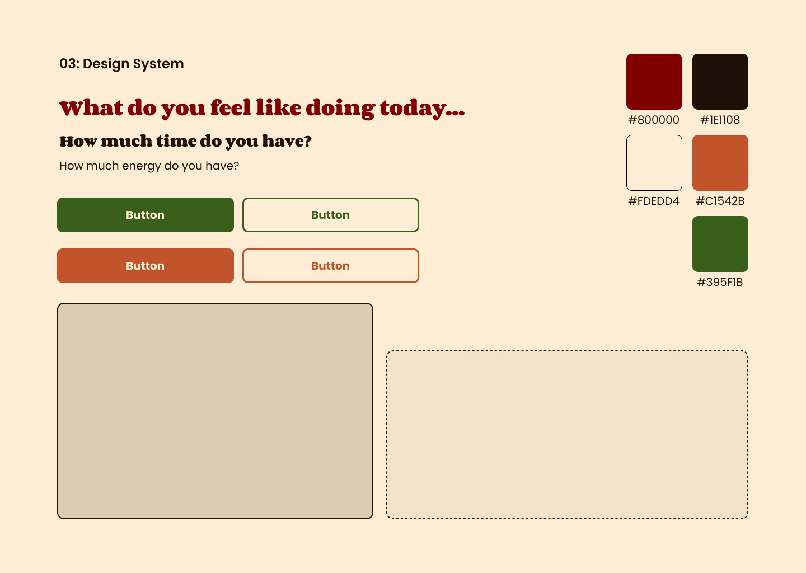

# 3. Design system

A short, fixed set of decisions (colors, type, spacing and the reusable components that use them), made once so every screen looks like the same product. Only the things the screens actually needed are in here.

The picture above is the visual version: the palette as swatches with hex codes, the button in both colors and both states, and two card placeholders. This file is the written reference that goes with it. It has the same values named as tokens, plus the decisions the picture doesn't spell out on its own: which color is primary and which is accent, what the unlabeled card color is, and one contrast fix.

## Styling approach

**Plain CSS with CSS Modules.** The tokens live as `:root` custom properties in `client/src/styles/tokens.css`, and each component's CSS Module uses them (`color: var(--color-primary)`) instead of hard-coded hex values. Changing a token changes it everywhere.

## Colors

Five colors, each with a role.

| Token | Role | Hex |
| --- | --- | --- |
| `--color-primary` | links, buttons, active states | `#395F1B` (green) |
| `--color-accent` | the one call to action on a screen, highlights | `#C1542B` (orange) |
| `--color-bg` | page background | `#FDEDD4` (cream) |
| `--color-surface` | cards and panels | `#DBCDB5` (muted tan) |
| `--color-text` | body text | `#1E1108` (near-black brown) |

Three more values came out of building the screens, and I kept them out of the five so the system stays small:

- **`--color-accent-text` (`#AD4B26`).** The accent used as a *background* (the filled orange button with white text) passes at 4.59:1. Used as *text or an outline* on the cream background, it only measures 3.99:1, under the 4.5:1 minimum. So `--color-accent` is for filled backgrounds only, and this slightly darker value is for accent text and outlines.
- **`--color-display` (`#800000`, maroon).** Used only for the big display line on Home.
- **`--color-surface-soft`.** A lighter tan, made by mixing 25% of `--color-surface` into `--color-bg` (about `#F4E5CC`). It fills the text inputs and the photo picker. It is derived, not a sixth color.

I checked contrast with the WebAIM formula for every pair that is actually used.

| Pair | Ratio | Passes 4.5:1? |
| --- | --- | --- |
| `--color-text` on `--color-bg` | 16.0:1 | Yes |
| `--color-text` on `--color-surface` | 11.8:1 | Yes |
| `--color-text` on `--color-surface-soft` (inputs) | 14.9:1 | Yes |
| white on `--color-primary` (filled button) | 7.4:1 | Yes |
| `--color-primary` on `--color-bg` (outline button) | 6.5:1 | Yes |
| `--color-primary` on `--color-surface` (outline button on the Login card) | 4.7:1 | Yes |
| white on `--color-accent` (filled button) | 4.6:1 | Yes, barely |
| `--color-accent` on `--color-bg` (old text and outline use) | 4.0:1 | **No**, replaced by `--color-accent-text` |
| `--color-accent-text` on `--color-bg` | 4.8:1 | Yes |
| `--color-accent-text` on `--color-surface` (tan card) | 3.5:1 | **No**, so accent text is only used on the cream page. Errors inside a card use `--color-text` with an accent left border |
| `--color-display` on `--color-bg` | 9.5:1 | Yes |

## Type

Two typefaces: **Poppins** for the interface (body, buttons, badges, labels) and **Corben** for the display line and the screen headings. Fallbacks are system-ui for Poppins and Georgia for Corben.

| Style | Size | Used for |
| --- | --- | --- |
| Display (`--font-size-display`) | 36px, Corben, maroon | the big line on Home |
| Heading (`--font-size-heading`) | 24px, Corben | screen and section titles |
| Label (`--font-size-label`) | 20px | the questions above the selectors |
| Body (`--font-size-body`) | 16px | paragraphs, descriptions, form labels, header buttons |
| Small (`--font-size-small`) | 13px | tags, badges, small buttons |

Large buttons use 20px (`--font-size-button-large`).

## Spacing and shape

One base unit of 8px, used in multiples for padding, gaps and margins.

| Token | Value | Used for |
| --- | --- | --- |
| `--space-1` | 8px | tight spacing between related items |
| `--space-2` | 16px | screen edge padding |
| `--space-4` | 24px | spacing between sections |
| `--radius` | 8px | buttons, cards, inputs |
| `--radius-large` | 12px | the larger surfaces |
| `--border-width` | 2px | cards, inputs, buttons and the dashed photo picker |
| `--column-width` | 480px | the centered column on most screens |
| `--column-width-wide` | 880px | Progress (two-column grid) |
| `--header-height` | 80px | the header, with a 64px logo (`--logo-height`) |

A few more width tokens (`--column-width-hero`, `--column-width-picker`, `--column-width-login`, `--column-width-activity`, `--header-width`) came from matching each screen to its wireframe.

## Reusable components

| Component | Level | Appears on | Props |
| --- | --- | --- | --- |
| `Header` | organism | Home, Suggestion, Proof, Progress | `activeLink` ('home' or 'progress'), `onSignOut` |
| `Button` | atom | all five screens | `variant` ('primary', 'accent', 'dark', 'maroon'), `style` ('filled' or 'outline'), `size` ('small', 'large', 'nav'), `fullWidth`, `type`, `onClick`, `disabled`, `children` |
| `Heading` | atom | all five screens | `level`, `display`, `centered`, `accent`, `children` |
| `TextField` | atom | Login, Proof | `id`, `label`, `value`, `onChange`, `multiline`, `type`, `hint`, `size` |
| `Tag` | atom | Suggestion, Proof, Progress (through `ActivityMeta`) | `label`, `size` |
| `Badge` | atom | Suggestion, Proof, Progress (through `ActivityMeta`) | `label`, `size` |
| `ActivityMeta` | molecule | Suggestion, Proof, Progress | `category`, `duration`, `difficulty`, `size` |
| `SelectorGroup` | molecule | Home (used twice, for time and for energy) | `legend`, `options`, `value`, `onChange` |
| `PhotoPicker` | molecule | Proof | `id`, `label`, `value`, `onChange`, `activityName`, `size` |
| `HistoryItem` | molecule | Progress | `name`, `category`, `duration`, `difficulty`, `completedAt` |
| `ActivityCard` | organism | Suggestion (full), Proof (`compact`) | `activity`, `compact`, `children` |
| `ProofForm` | organism | Proof | `activity`, `value`, `onChange`, `onSubmit`, `submitting` |
| `HistoryList` | organism | Progress | `completions`, `activities` |
| `PageLayout` | layout | Home, Suggestion, Proof, Progress | `activeLink`, `onSignOut`, `wide`, `centered`, `activity`, `children` |

A few rules the components follow:

- **Cards** (`ActivityCard`, `HistoryItem`, the Login card) have a `--color-surface` fill, a 2px solid `--color-text` border, an 8px radius and 24px padding (16px when compact).
- **Selector buttons** show the chosen option as a filled primary button and the others as outline primary buttons, with `aria-pressed` set.
- **One filled accent button per screen** is the main call to action: Find an activity, Do this, Mark Complete, Sign in.
- **`TextField`** has its label above in semibold, and its input text is 16px, because smaller text makes iPhones zoom in.
- **The photo picker** has a dashed 2px border, the soft tan fill, and the whole box is the tap target.
- **`Tag`** uses the cream fill so it stands out on a tan card.

## Responsive plan

There is one breakpoint, **600px**. I checked it in a browser at 375px, 599px, 600px and 1280px.

- Below 600px: the Home selectors stack, the Suggestion buttons stack with "Do this" on top, the Progress list is one column, the header wraps to two rows, and nothing scrolls sideways at 375px.
- From 600px up: the Home selectors sit side by side, the Suggestion buttons sit side by side, and Progress is a two-column grid.

## Accessibility check

- [x] Every text-on-background pair that is used passes 4.5:1, as in the table above, with `--color-accent-text` for any accent text.
- [x] Real semantic elements: `<header>` and `<nav>` for the header, `<main>` around each page's content, and real `<button>` elements for every `Button`.
- [x] Meaningful images have alt text. The photo preview uses the activity name, and the decorative logo uses an empty `alt`.
- [x] Every form input has a label tied to it with `htmlFor` and `id`.
- [x] Everything can be reached with the Tab key, and a visible focus style (`:focus-visible`) is set globally. I did not remove the focus ring.
- [x] Errors use `role="alert"` and status messages use `role="status"`, so a screen reader announces them.
